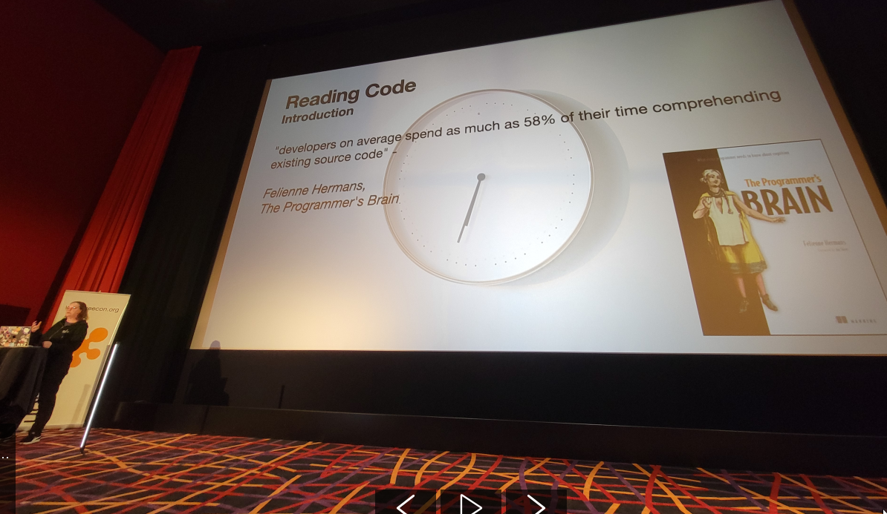

I recently attended GeeCon Prague, an event I had never been to before. While it wasn't as grand as the big Krakow event, I still found it a worthwhile decision to attend. Here are some highlights and things that resonated with me:

## What I Discovered and Deepened My Understanding On
- **Availability Bias**: While I've always felt its presence, I now have a formal term and understanding of it.

- The **Big Rewrite Song** by Dylan Beattie is a beautiful one:  
    
     

- There is evidence supporting my frequent claim that developers spend more time reading code than writing it. This is further discussed in the book 'The Programmer's Brain'.

    

- There's an insightful talk on _How to Teach_ that isn't exclusive to programmers. I found it enlightening and recommend it:
    
     

- Interesting fact: Only 37% of code written five years ago is still in use today.

    

- The "**First Glance**" technique for reading code is intriguing. It involves group members sharing what stood out to them in the initial minute of reading a piece of code. I now want to try this in an ensemble setting.

- You don't really need anything other than Redis 🤣.

- There is more to Pattern Matching than I had anticipated.

- Java's efficiency has notably improved.

    

- **On Crafting Better IDs**:
    While UUIDs are reliable, they're not the fastest. Creating a custom solution could be more efficient. UUIDs rely on secrandom, which is often unnecessary and slows down the process.

    XUID variations exist that maintain order. If you're keen on using UTC, consider synchronizing time across services with NTP. A suggestion for EventIds: prefix them with the domain they originate from. To avoid potential issues, implement a processing count to ward off circular flows and employ tracingIds to streamline debugging in microservices.

## Moments of Inspiration and Reflection
- It felt good seeing Michael Feather's Talk, as it provided me with a different perspective on trying to TDD with ChatGPT. Also, it was nice to exchange Ideas on the topic.

    

- Tannaz N. Roshandel highlighted the ethical challenges we face in a rapidly changing world in the digital age. I wholeheartedly agree. As we employ AI for sophisticated classification and recommendation, we amplify division. Can we harness AI to counteract this?

- Overall, the technological landscape is constantly evolving and increasing in its complexity, overshadowing what is essential. To break the **cycle of creating messes**, we must shift our **focus on the fundamentals**. However, I've come to see that serverless might be a promising solution.

- Meeting [Bogo](https://talkweb.eu/) and heading to a pub with him to enjoy some excellent Czech beer was definitely a highlight! 
Thanks Bogo! 🍻

### More Photos
Bogos Talk.

He smashed his Phone 🤯

Michael Feathers proposed an idea on how to understand code using ChatGPT.

I had a nice view from the balcony of my hotel.

Prague at Night.

Prague at Day.
