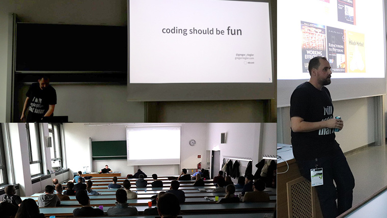

<article class="post-body">
    <h3>coding should be fun <a href="https://devfest.at/">@DevFestVienna</a></h3>
    
    

        16 Nov 2019
    

    
    
    
    <ul>
     <li>slides: <a href="http://gregorriegler.com/talk-coding-should-be-fun/">coding should be fun</a></li>
     <li>code: <a href="https://github.com/gregorriegler/Theatrical-Players-Refactoring-Kata/commit/05a34ed5507be62dd93f5d8999ac4cc6557a6a8b">diff i performed at the venue</a></li>
    </ul>
</article>

<article class="post-body">
    <h3>coding should be fun <a href="https://fccvienna.github.io/">@FreeCodeCampVienna</a></h3>

    

        05 Sep 2019
    

    
     
    <ul>
     <li>slides: <a href="https://slides.com/gregorriegler/deck-2#/">coding should be fun</a></li>
    </ul>

</article>

