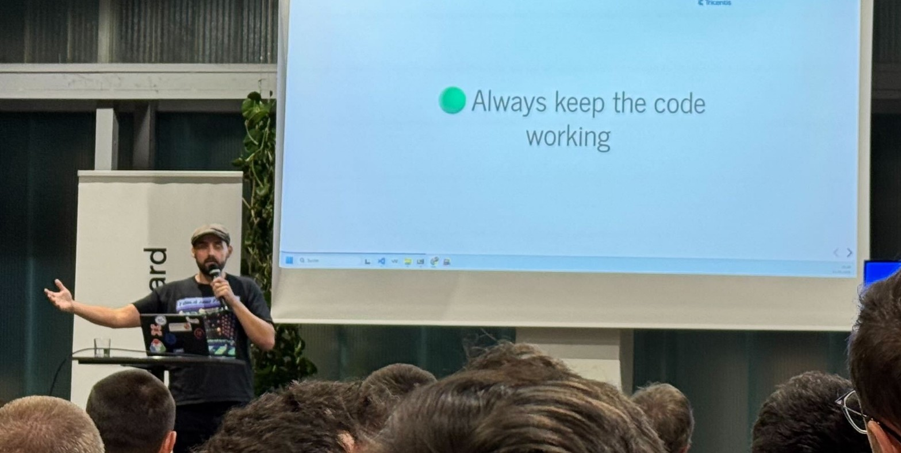
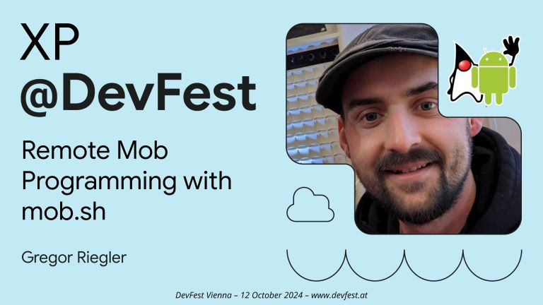
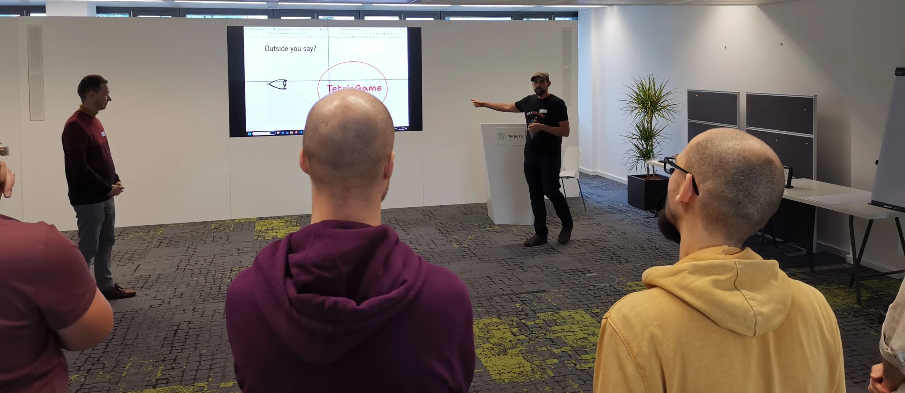
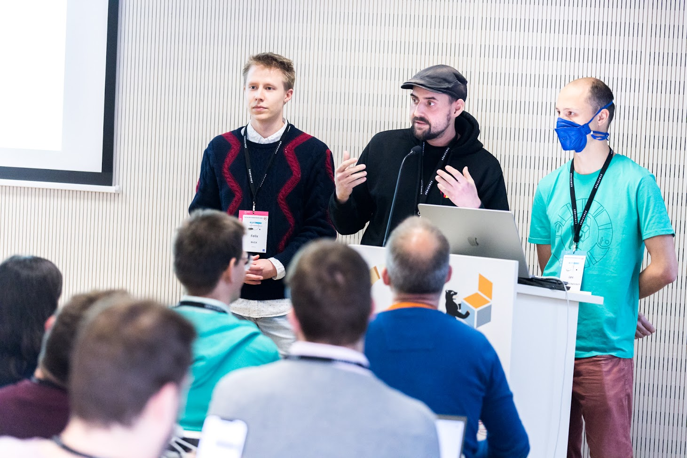
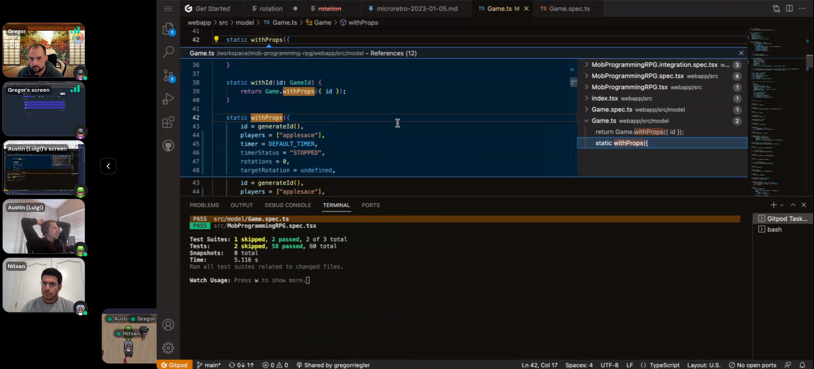
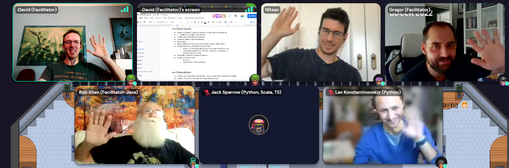

<article class="post-body">
    <h3>Patterns for AI Augmented Coding @ AI4dev Brno</h3>

    

        21 October 2025
    

    
    
     
    In this talk, I shared my story of how I learned to teach AI a Software Crafter’s approach to development.
</article>
<article class="post-body">
    <h3>Software Engineering Meetup Brno</h3>

    

        11 September 2025
    

    
    How far can we let AI code on its own? I shared patterns for extending the autonomy of coding agents in a sustainable way.
</article>
<article class="post-body">
    <h3>Global Day Of Coderetreat 2024 Vienna</h3>

    

        November 2024
    

    
    Co-organized and facilitated the GDCR 2024 in Vienna, where we focused on incremental software development. It was a blast.
</article>
<article class="post-body">
    <h3>Mob Programming with mob.sh @ DevFest Vienna 2024</h3>

    

        October 2024
    

    
</article>

<article class="post-body">
    <h3>Global Day Of Coderetreat 2023 Vienna</h3>

    

        November 2023
    

    
    Facilitated the <i>"Outside-In TDD without Mocks"</i> session as well as a Mob Programming session.
    Overall Co-Facilitation.
</article>

<article class="post-body">
    <h3>Software Development Myths @ DevFest Vienna 2023</h3>

    

        October 2023
    

    I gave a Lightning Talk about Myths in Software Development.
     
     
    <ul>
     <li>Slides: <a href="/assets/myths_in_software_development.pdf">Myths in Software Development</a></li>
    </ul>
</article>

<article class="post-body">
    <h3>Mob Mentality Show: Mobbing on the Open Source Mob RPG</h3>

    

        May 2023
    

    
     
    In this episode of the <a href="https://www.youtube.com/@mobmentalityshow">Mob Mentality Show</a>, I talked about "Mobbing on the <a href="https://github.com/gregorriegler/mob-programming-rpg">Open Source Mob RPG</a>". We start by discussing the origin story of the app and the weekly public mob session to work on it. We also cover examples of fun, surprising, and innovative remote mob sessions, as well as a walkthrough of the app page by page. We then dive into the tech stack, tools, and collaboration methodology used in the app's development. 
</article>

<article class="post-body">
    <h3>Ensemble Programming Workshop @ PyConDE</h3>
    
    

        18 April 2023
    

    
    
     
    Gave an Ensemble Programming workshop facilitating a huge Ensemble of 80 people together with <a href="https://twitter.com/teagermylk">Lev Konstantinovskyi</a> at the <a href="https://2023.pycon.de/">PyCon DE & PyData Berlin 2023</a>. 
    The participants excelled both in solving the <a href="https://github.com/Real-Estate-Kata/real-estate-pydantic-kata">Real-Estate-Kata</a> and providing mutual support to one another.
    They initiated a clap-on-green behavior and maintaned it even after splitting into smaller ensembles.
     
     
    
</article>

<article class="post-body">
    <h3>Public Mob for the Mob Programming RPG</h3>
    
    

        2023 - ?
    

    
    
    Facilitating a weekly public mob where we develop a <a href="https://github.com/gregorriegler/mob-programming-rpg">webapp for the Mob Programming RPG</a>.
    Feel free to <a href="https://github.com/gregorriegler/mob-programming-rpg#contribute">join</a>.
</article>

<article class="post-body">
    <h3>Global Day Of Continuous Coderetreat 2022</h3>
    
    

        4 Nov 2022
    

    
    
    Facilitated the first truly <a href="https://coderlevelup.org/globaldayofcoderetreat2022-48hr">Global Day Of Coderetreat</a> together with Bob Allen, Nitsan Avni, David Campey and Siddhesh Nikude.
</article>

<article class="post-body">
    <h3>Mobbing Discussion (Interview by Tsvetan Tsventanov)</h3>
    
    

        15 Aug 2022
    

    
    
</article>

<article class="post-body">
    <h3>Coding should be fun <a href="https://devfest.at/">@DevFestVienna</a></h3>
    
    

        16 Nov 2019
    

    
    
    
    <ul>
     <li>slides: <a href="http://gregorriegler.com/talk-coding-should-be-fun/">coding should be fun</a></li>
     <li>code: <a href="https://github.com/gregorriegler/Theatrical-Players-Refactoring-Kata/commit/05a34ed5507be62dd93f5d8999ac4cc6557a6a8b">diff i performed at the venue</a></li>
    </ul>
</article>

<article class="post-body">
    <h3>Coding should be fun <a href="https://fccvienna.github.io/">@FreeCodeCampVienna</a></h3>

    

        05 Sep 2019
    

    
     
    <ul>
     <li>slides: <a href="https://slides.com/gregorriegler/deck-2#/">coding should be fun</a></li>
    </ul>

</article>
